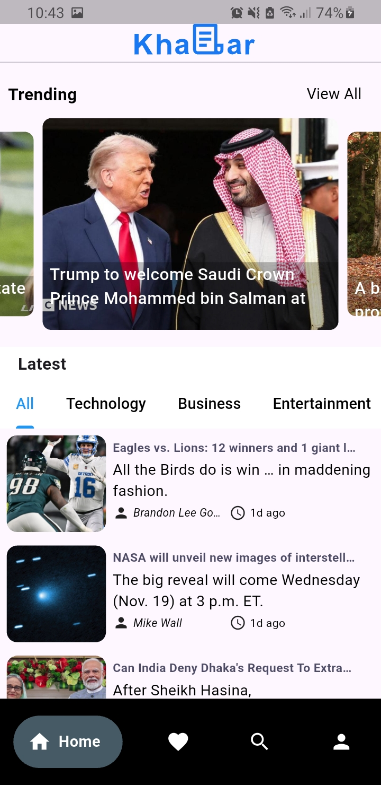
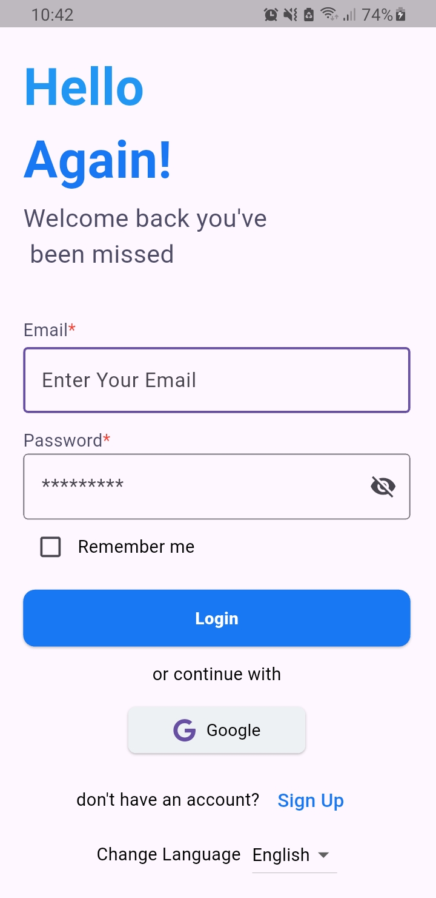
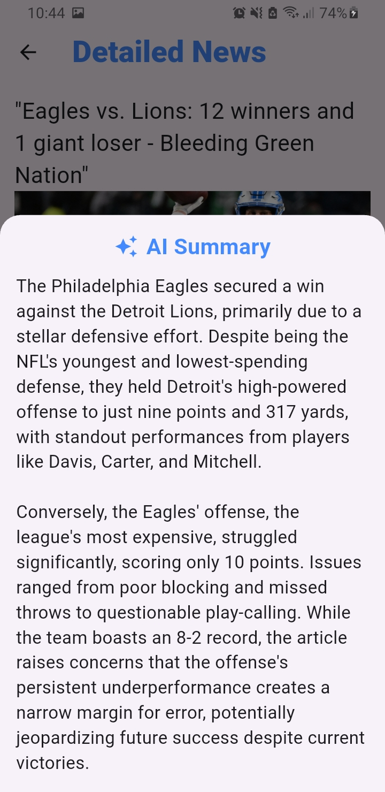
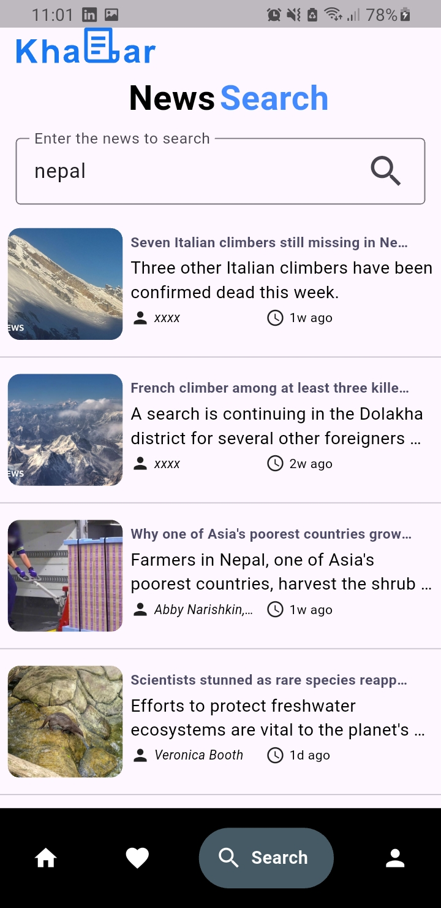
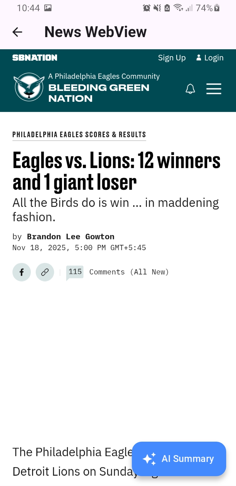

# News App 'KHABAR'

A modern Flutter news application that lets users **read, search, favorite, and summarize news articles** with AI-powered summaries.  
The app supports **login/authentication via Firebase**, **offline favorites using Hive**, and **English & Nepali localization**.

## Features

- **Browse top headlines** from multiple categories  
- **Search news articles** with keywords  
- **Favorite articles** for offline reading (saved with Hive)  
- **AI-powered article summaries** using Gemini AI  
- **WebView** to read full articles without leaving the app  
- **Login / Authentication** with Google Firebase  
- **Profile Management** – users can update their details in Firebase  
- **Localization** – English & Nepali supported  
- **Clean, responsive UI** following Clean Architecture  
- **State Management** with Bloc  
- **Networking** with Dio  
- 

## Screenshots

  <figure>
    
    <figcaption>Home Screen - Top headlines</figcaption>
  </figure>
  <figure>
    
    <figcaption>Login Screen - Firebase Authentication</figcaption>
  </figure>
  <figure>
    
    <figcaption>Article Details Screen</figcaption>
  </figure>

  <figure>
    
    <figcaption>AI Summary using Gemini AI</figcaption>
  </figure>
  <figure>
    
    <figcaption>Favorite Articles - Saved offline with Hive</figcaption>
  </figure>
  <figure>
    
    <figcaption>Search News Articles</figcaption>
  </figure>
  <figure>
    
    <figcaption>WebView - Read full articles</figcaption>
  </figure>

## Getting Started

If this is your first Flutter project, here are some resources:

- [Flutter Codelab: Write your first app](https://docs.flutter.dev/get-started/codelab)  
- [Flutter Cookbook: Useful samples](https://docs.flutter.dev/cookbook)  
- [Flutter Documentation](https://docs.flutter.dev/)  

### Requirements

- Flutter SDK >= 3.0  
- Dart >= 3.0  
- Internet connection for fetching news  

## How to Run

1. Clone this repository  
git clone <your-repo-url>

2. Navigate to the project folder
cd news_app

3. Install packages
flutter pub get

4. Run the app
flutter run 

### Tech Stack

Flutter – Cross-platform mobile development

Dart – Programming language

Bloc – State management

Clean Architecture – Project structure & best practices

Dio – Networking

Hive – Offline storage (favorites)

Firebase Auth – Google login & user management

Gemini AI – Article summarization

NewsAPI.org – Fetch news & search functionality

Localization – English & Nepali

## Author

**Dev Subedi**  
[LinkedIn](https://www.linkedin.com/in/dev-subedi-unik-225305380/) | [Email](mailto:Devsubedi10@gmail.com)
